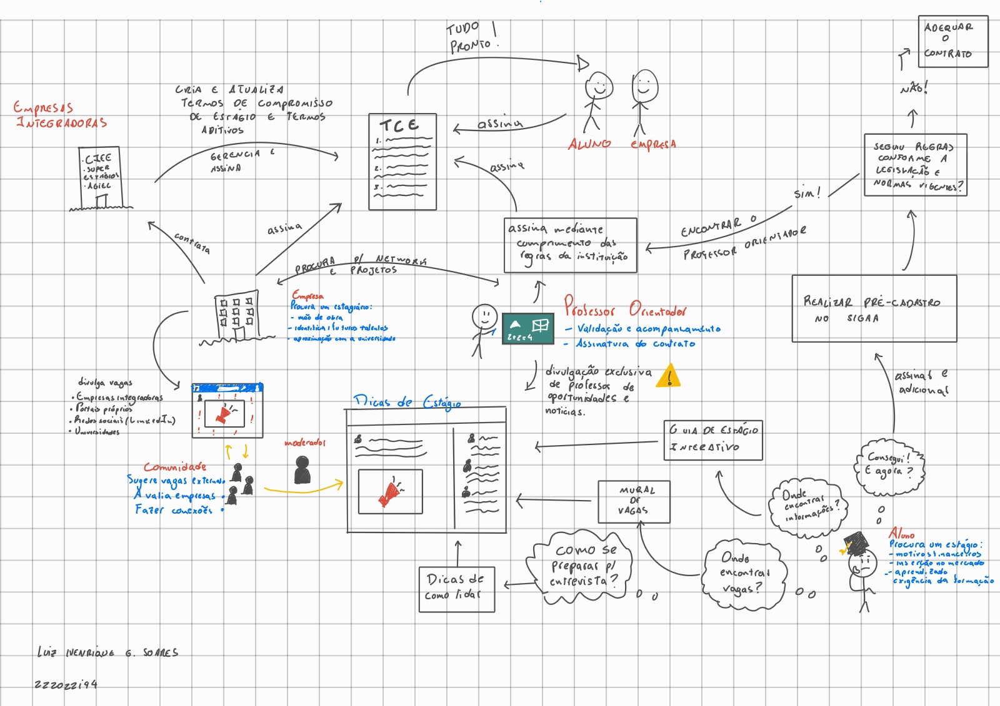
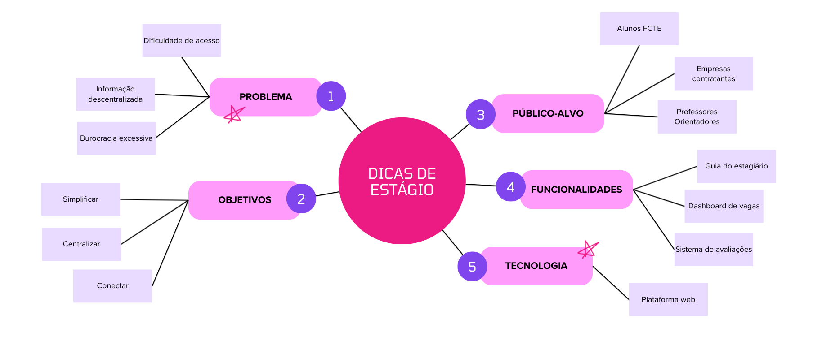

# 1.2. Módulo Artefato Generalista

## Objetivo do Artefato

Produzir **artefatos independentes de metodologia** que sintetizem o escopo e os principais elementos do projeto, facilitando o entendimento comum entre todas as partes interessadas.

Para fundamentar nossa aplicação e compreender melhor o que é nosso produto, utilizamos mais de uma técnica de levantamento e representação. Assim, diferentes perspectivas foram exploradas para garantir uma visão abrangente do sistema.

### Artefatos produzidos:
- **Rich Picture**  
- **Diagrama Causa–Efeito/Ishikawa**  
- **Mapa Mental**
- **5W2H**

---

  <iframe 
    src="https://miro.com/app/board/uXjVJNoiQ50=/" 
    frameborder="0" 
    allowfullscreen 
    style="position: absolute; top:0; left:0; width:100%; height:100%;">
  </iframe>

## Rich Picture — Visão Geral 

Por que Rich Picture? É expressivo, generalista e não amarra a equipe a uma metodologia específica — ideal para comunicar **visão de sistema**, **atores**, **fluxos** e **pontos de dor** do nosso portal de estágios.

__O que o Rich Picture cobre:__

- **Domínios do site:** Guia do Estágio, Oportunidades, Avaliações de Estágios.  
- **Atores-chave:** Estudantes, Comunidade, Empresas, Professores/Orientadores, Coordenação de Estágio, Secretaria.  
- **Cenários comuns:** Assinatura de contrato (obrigatório x não-obrigatório), como solicitar assinaturas, regras e prazos, curadoria de oportunidades internas, publicação/consulta de avaliações, .  
- **Pontos de dor mapeados:** Falta de informação consolidada, dúvidas sobre fluxo de assinatura, critérios de elegibilidade para oportunidades , qualidade/credibilidade das avaliações.

Ressalta-se que o artefato produzido foi **inspirado no conceito de Rich Picture**, mas não seguiu rigorosamente todas as regras formais dessa técnica. O objetivo foi adaptar a abordagem para representar de forma visual e acessível os principais elementos do sistema, priorizando clareza e comunicação entre os membros do grupo. Todos os integrantes esboçaram individualmente suas versões, e ao final, consolidou-se os pontos mais relevantes em um único artefato representativo.

---

## Diagrama Causa–Efeito (Ishikawa)

Durante a análise do processo de empregabilidade dos alunos da Universidade de Brasília (UnB), foi identificado que muitos estudantes enfrentam dificuldades para conseguir estágio. Para compreender melhor os fatores que contribuem para esse problema, aplicou-se a técnica do **Diagrama de Causa-Efeito** (também conhecido como **Diagrama de Ishikawa** ou **Espinha de Peixe**).

Esse tipo de diagrama permite visualizar, de forma clara e estruturada, as possíveis causas de um problema central, organizando-as em categorias que abrangem diferentes aspectos do sistema. A partir dessa análise, é possível identificar os principais pontos de melhoria e orientar ações estratégicas para aumentar a empregabilidade dos alunos.

## Diagrama (imagem)

Abaixo está o diagrama de Causa-Efeito elaborado pelo Grupo 5.

---

## Pergunta Central
**Por que os alunos da UnB apresentam baixa empregabilidade nos estágios?**

O Diagrama de Causa-Efeito foi utilizado para identificar, de forma estruturada, os principais fatores que dificultam o acesso dos alunos a estágios e, consequentemente, reduzem sua empregabilidade.

---

## Categorias e Causas Identificadas

### 1. Empresas com pouca flexibilidade
- Modelo de turno da UnB não se adequa à maioria das empresas.  
- Empresas não se adaptam aos horários da universidade.  

### 2. Excesso de burocracia
- Muitas empresas não possuem contrato com a UnB.  
- Necessidade de cadastro individual de cada empresa envolvida.  

### 3. Poucas informações dos locais de estágio
- Falta de feedback dos alunos em relação às empresas/órgãos públicos.  
- UnB não oferece uma listagem ampla e acessível de estágios disponíveis.  

### 4. Pouco incentivo da FCTE
- Limitação de horário (UnB x estágio).  
- Falta de empatia dos docentes com os alunos.  
- Professores não divulgam as oportunidades de estágio.  

### 5. Informação pouco difundida
- Centralização das informações em apenas um lugar.  
- Alunos não se importam em compartilhar informações.  

### 6. Alunos pouco engajados
- Falta de iniciativa dos alunos em buscar informações sobre estágios.  

## Conclusão
O diagrama evidencia que a **pouca empregabilidade dos alunos da UnB** não é resultado de uma única causa, mas sim da combinação de fatores institucionais, burocráticos, organizacionais e comportamentais.  
A identificação dessas causas permite direcionar esforços para **reduzir a burocracia, ampliar a divulgação das oportunidades, melhorar a comunicação entre UnB e empresas e estimular maior engajamento dos alunos**.

## Mapa Mental 

**Uso do Mapa Mental:** Além do Desenho inspirado no Rich Picture e do Ishikawa, também elaboramos um **Mapa Mental**. Escolhemos esse artefato por ser intuitivo e de fácil construção, principalmente em uma etapa inicial do projeto. O mapa mental nos ajudou a organizar ideias de forma rápida, visualizar conexões entre conceitos e levantar hipóteses sem nos prender a estruturas rígidas.

## Justificativas & Senso Crítico

- **Independência metodológica:** Rich Picture, Mapa Mental e Ishikawa são **Artefatos Generalistas**, úteis tanto em contextos ágeis quanto preditivos.  

- **Lições aprendidas:** Trabalhar no Miro de forma colaborativa aumentou a clareza entre os membros. Entretanto, tivemos de refinar símbolos e legendas para que ficassem compreensíveis a quem não participou da construção.  

---

  
## Referências

## Histórico de Versões

| Versão | Descrição | Autor | Data | Revisor |
|--------|-------------------------------------------------------------|------------------------------------------|------------|------------------------------------------|
| 1.0    | Criação do documento e organização de todo o conteúdo       | [Letícia da Silva Monteiro](https://github.com/leticiamonteiroo) | 04/09/2025 | [Henrique Martins Alencar](https://github.com/henryqma) |
| 1.1    | Melhorias estruturais no documento                         | [Luiz Henrique Gomes Soares](https://github.com/luizh-gsoares)    | 05/09/2025 | [Letícia da Silva Monteiro](https://github.com/leticiamonteiroo) |

---

Fonte: [Letícia da Silva Monteiro](https://github.com/leticiamonteiroo) e [Luiz Henrique Guimarães Soares](https://github.com/luizh-gsoares) 2025.

