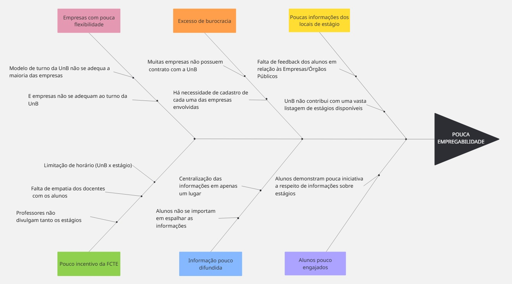

# Diagrama de Causa-Efeito (Ishikawa) — Estágio Universitário na UnB

## Introdução
Durante a análise do processo de empregabilidade dos alunos da Universidade de Brasília (UnB), foi identificado que muitos estudantes enfrentam dificuldades para conseguir estágio. Para compreender melhor os fatores que contribuem para esse problema, aplicou-se a técnica do **Diagrama de Causa-Efeito** (também conhecido como **Diagrama de Ishikawa** ou **Espinha de Peixe**).

Esse tipo de diagrama permite visualizar, de forma clara e estruturada, as possíveis causas de um problema central, organizando-as em categorias que abrangem diferentes aspectos do sistema. A partir dessa análise, é possível identificar os principais pontos de melhoria e orientar ações estratégicas para aumentar a empregabilidade dos alunos.

---

## Pergunta Central
**Por que os alunos da UnB apresentam baixa empregabilidade nos estágios?**

O Diagrama de Causa-Efeito foi utilizado para identificar, de forma estruturada, os principais fatores que dificultam o acesso dos alunos a estágios e, consequentemente, reduzem sua empregabilidade.

---

## Diagrama (imagem)

Abaixo está o diagrama de Causa-Efeito elaborado pelo Grupo 5.

Figura: Diagrama de Causa-Efeito (arquivo: `assets/imgs/G5_ARQDSW_1.jpg`).

## Categorias e Causas Identificadas

### 1. Empresas com pouca flexibilidade
- Modelo de turno da UnB não se adequa à maioria das empresas.  
- Empresas não se adaptam aos horários da universidade.  

### 2. Excesso de burocracia
- Muitas empresas não possuem contrato com a UnB.  
- Necessidade de cadastro individual de cada empresa envolvida.  

### 3. Poucas informações dos locais de estágio
- Falta de feedback dos alunos em relação às empresas/órgãos públicos.  
- UnB não oferece uma listagem ampla e acessível de estágios disponíveis.  

### 4. Pouco incentivo da FCTE
- Limitação de horário (UnB x estágio).  
- Falta de empatia dos docentes com os alunos.  
- Professores não divulgam as oportunidades de estágio.  

### 5. Informação pouco difundida
- Centralização das informações em apenas um lugar.  
- Alunos não se importam em compartilhar informações.  

### 6. Alunos pouco engajados
- Falta de iniciativa dos alunos em buscar informações sobre estágios.  

## Conclusão
O diagrama evidencia que a **pouca empregabilidade dos alunos da UnB** não é resultado de uma única causa, mas sim da combinação de fatores institucionais, burocráticos, organizacionais e comportamentais.  
A identificação dessas causas permite direcionar esforços para **reduzir a burocracia, ampliar a divulgação das oportunidades, melhorar a comunicação entre UnB e empresas e estimular maior engajamento dos alunos**.
